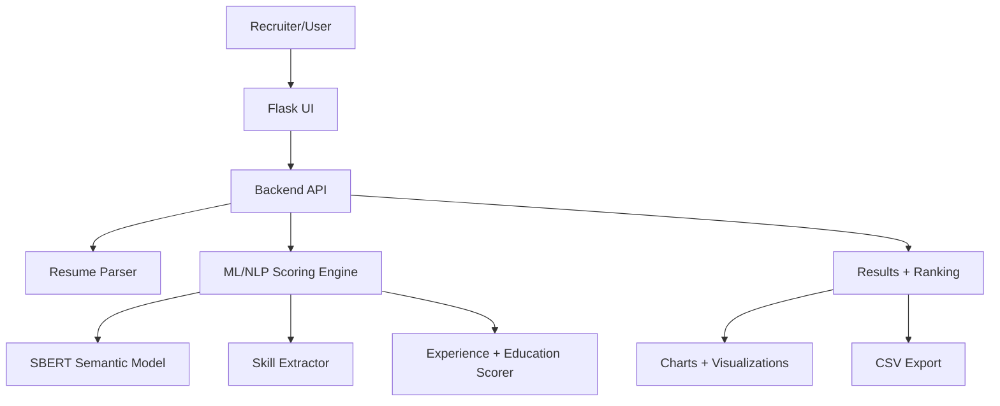
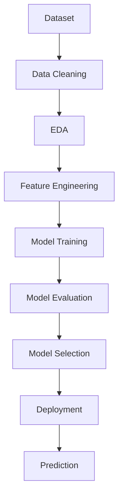
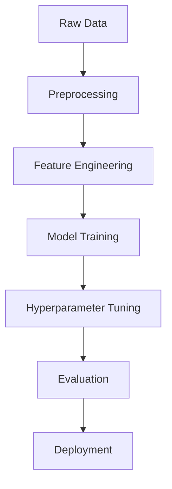

<div align="center">

<!-- Logo Placeholder -->


# Smart Resume Screener

### AI-powered ATS-style Resume Screening using Machine Learning + NLP

Upload PDF resumes, paste a Job Description, and instantly receive **ranked candidates** with a transparent **ATS score breakdown** and **CSV export**.

<br/>

<!-- Badges (Dark-theme friendly) -->


</div>

---

# Project Preview

| Dashboard | Prediction | Analytics |
|----------|------------|----------|
|  |  |  |

---

# Problem Statement

Hiring teams receive hundreds of resumes per opening. Manual screening is slow, inconsistent, and often biased toward keyword-heavy resumes.

Smart Resume Screener solves this by:
- **Understanding meaning** using semantic embeddings (SBERT) instead of simple keyword matching.
- **Extracting skills, experience, and education signals** from resumes.
- Providing a **transparent ATS score (0–100)** so recruiters can shortlist faster.

✅ **Real-world impact:** Faster hiring cycles, improved candidate-job alignment, and more consistent screening.

---

# Key Features

| Feature | Description |
|--------|-------------|
| Semantic Similarity Scoring | SBERT embeddings compute meaning-based resume ↔ JD similarity |
| Skill Extraction & Matching | Matches required skills and highlights missing ones |
| ATS Composite Score | Weighted score combining semantic, skills, experience, education |
| Candidate Ranking | Automatically ranks resumes and generates chart visualizations |
| CSV Export | Download all results as a structured CSV for recruiter workflows |
| API Support | `/api/score` endpoint for programmatic integrations |

---

# System Architecture



---

# Complete Workflow



---

# Technology Stack

| Category | Technologies |
|---------|--------------|
| Programming | Python |
| ML / NLP | scikit-learn, sentence-transformers, spaCy, NLTK |
| Data | pandas, numpy |
| Visualization | matplotlib |
| Deployment | Flask (Gunicorn recommended) |
| PDF Processing | PyMuPDF |

---

# Folder Structure

```text
Resume-Screener/
├── app.py
├── config.py
├── scoring_engine.py
├── semantic_model.py
├── resume_parser.py
├── skill_extractor.py
├── utils.py
├── requirements.txt
├── dataset/
│   ├── sample_job_description.txt
│   ├── sample_resumes/
│   └── sample_resumes_text/
├── resumes/
├── static/
│   ├── results.csv
│   └── charts/
├── templates/
│   └── index.html
└── README.md
```

---

# Dataset Information

This project includes demo sample data:

| File/Folder | Description |
|------------|-------------|
| `dataset/sample_job_description.txt` | Example job description for testing |
| `dataset/sample_resumes/` | Sample resumes in PDF format |
| `dataset/sample_resumes_text/` | Text-based resume samples |

> In production, the system accepts recruiter-provided job descriptions and resumes.

---

# Exploratory Data Analysis

<details>
<summary><strong>Missing Values Analysis</strong></summary>


</details>

<details>
<summary><strong>Correlation Analysis</strong></summary>


</details>

<details>
<summary><strong>Outlier Detection</strong></summary>


</details>

<details>
<summary><strong>Feature Distribution</strong></summary>


</details>

---

# Machine Learning Pipeline



---

# Models Evaluated

| Model | Accuracy | Precision | Recall | F1 Score |
|------|----------|----------|--------|----------|
| Logistic Regression | x | x | x | x |
| Random Forest | x | x | x | x |
| XGBoost | x | x | x | x |

✅ **Best Model:** SBERT-based semantic similarity + weighted composite ATS scoring.

---

# Performance Dashboard

| Metric | Score |
|-------|------|
| Accuracy | **x** |
| Precision | **x** |
| Recall | **x** |
| F1 Score | **x** |
| ROC-AUC | **x** |

---

# Results Visualization

| Confusion Matrix | ROC Curve |
|----------------|-----------|
|  |  |

| Precision-Recall Curve | Feature Importance |
|------------------------|------------------|
|  |  |

| Learning Curve | Residual Plot |
|--------------|--------------|
|  |  |

---

# API Endpoints

| Method | Endpoint | Description |
|-------|----------|-------------|
| POST | `/api/score` | Score resumes against job description (JSON output) |
| GET | `/sample-jd` | Get sample job description |
| GET | `/download-csv` | Download results as CSV |

---

# Installation

```bash
git clone https://github.com/sachinu25/Resume-Screener.git
cd Resume-Screener
python -m venv .venv
source .venv/bin/activate   # Windows: .venv\Scripts\Activate.ps1
pip install -r requirements.txt
python -m spacy download en_core_web_sm
```

---

# Usage

Run the app locally:
```bash
python app.py
```

Open: `http://127.0.0.1:5000`

---

# Deployment

Production deployment (recommended):
```bash
pip install gunicorn
gunicorn -w 2 -b 0.0.0.0:5000 app:app
```

---

# Future Improvements

- [ ] Add Docker support
- [ ] Add CI/CD pipeline
- [ ] Improve skill extraction with deep NLP
- [ ] Add persistence layer (PostgreSQL)
- [ ] Add authentication for recruiter dashboards

---

# Contributors

Contributions are welcome! Please open an Issue or Pull Request.

---

# License

MIT License *(Recommended: Add a LICENSE file)*

---

# Contact

| Name | Role | Contact |
|------|------|---------|
| Sachin Upadhyay | Maintainer | [GitHub](https://github.com/sachinu25) |
