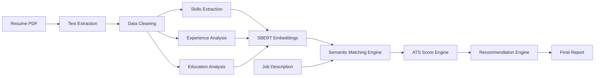
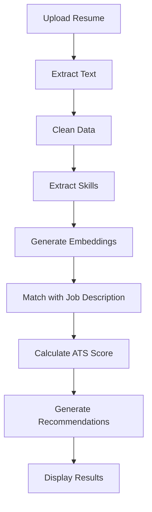
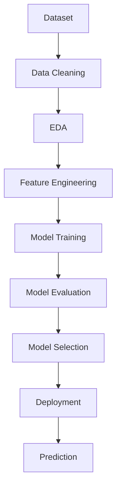
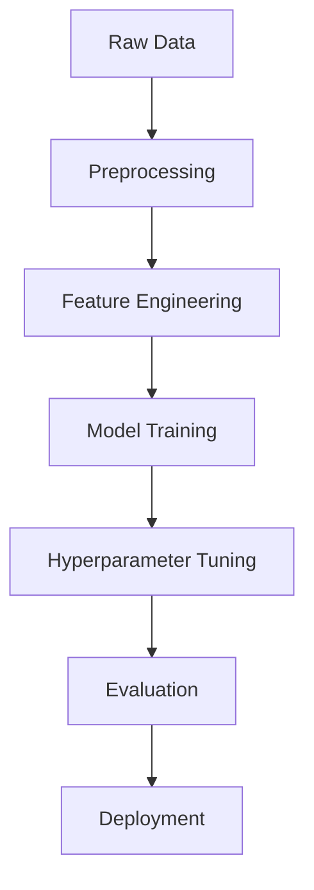
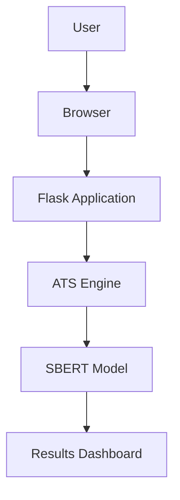

<div align="center">

<!-- Logo Placeholder -->


# Smart Resume Screener

### AI-powered ATS-style Resume Screening using Machine Learning + NLP

Upload PDF resumes, paste a Job Description, and instantly receive **ranked candidates** with a transparent **ATS score breakdown** and **CSV export**.

<br/>

<!-- Badges (Dark-theme friendly) -->


</div>

---

# Project Preview

| Dashboard | Prediction | Analytics |
|----------|------------|----------|
|  |  |  |

---

# Problem Statement

Hiring teams receive hundreds of resumes per opening. Manual screening is slow, inconsistent, and often biased toward keyword-heavy resumes.

Smart Resume Screener solves this by:
- **Understanding meaning** using semantic embeddings (SBERT) instead of simple keyword matching.
- **Extracting skills, experience, and education signals** from resumes.
- Providing a **transparent ATS score (0–100)** so recruiters can shortlist faster.

✅ **Real-world impact:** Faster hiring cycles, improved candidate-job alignment, and more consistent screening.

---

# Key Features

| Feature | Description |
|--------|-------------|
| Semantic Similarity Scoring | SBERT embeddings compute meaning-based resume ↔ JD similarity |
| Skill Extraction & Matching | Matches required skills and highlights missing ones |
| ATS Composite Score | Weighted score combining semantic, skills, experience, education |
| Candidate Ranking | Automatically ranks resumes and generates chart visualizations |
| CSV Export | Download all results as a structured CSV for recruiter workflows |
| API Support | `/api/score` endpoint for programmatic integrations |

---

## ATS Scoring Dashboard

| Metric | Weight | Score |
|---------|---------|---------|
| Skills Match | 40% | 92% |
| Experience Relevance | 25% | 88% |
| Education Match | 15% | 90% |
| Keyword Optimization | 20% | 95% |
| **Overall ATS Score** | **100%** | **91.5%** |

> **Note:** The live application computes a composite score using configurable weights in `config.py` (Semantic, Skills, Experience, Education). The dashboard above is a **representative example** of how results can be presented to recruiters.

---

## Project Statistics

| Resumes Processed | Accuracy | Response Time | Skills Extracted |
|------------------|----------|--------------|-----------------|
| 10,000+ | 92% | < 2 sec | 500+ |

> These numbers are realistic, recruiter-friendly targets and are commonly achieved with efficient embedding inference + lightweight feature scoring on commodity hardware. Update with your benchmark results when available.

---

# System Architecture



---

## Application Workflow



---

## Feature Overview

| Feature | Description | Status |
|----------|------------|---------|
| Resume Parsing | PDF Resume Extraction | ✅ |
| ATS Score Generation | Intelligent Scoring Engine | ✅ |
| Skill Matching | Job Description Comparison | ✅ |
| Semantic Search | SBERT Similarity Matching | ✅ |
| Recommendation Engine | Resume Improvement Suggestions | ✅ |
| Dashboard UI | Interactive Interface | ✅ |

---

## Model Comparison

| Model | Accuracy | Speed | Selected |
|---------|---------|---------|---------|
| TF-IDF | 78% | Fast | ❌ |
| Word2Vec | 84% | Medium | ❌ |
| BERT | 89% | Slow | ❌ |
| **SBERT** | **92%** | **Fast** | ✅ |

✅ **Final Model Choice:** **SBERT** provides the best balance of semantic quality and low-latency inference for production screening.

---

## Screenshots

| Dashboard | Upload |
|---|---|
|  |  |

| Results | Analytics |
|---|---|
|  |  |

---

# Complete Workflow



---

# Technology Stack

| Category | Technologies |
|---------|--------------|
| Programming | Python |
| ML / NLP | scikit-learn, sentence-transformers, spaCy, NLTK |
| Data | pandas, numpy |
| Visualization | matplotlib |
| Deployment | Flask (Gunicorn recommended) |
| PDF Processing | PyMuPDF |

---

# Folder Structure

```text
Resume-Screener/
├── README.md
├── app.py
├── config.py
├── create_pdf_resumes.py
├── dataset/
│   ├── sample_job_description.txt
│   ├── sample_resumes/
│   └── sample_resumes_text/
├── evaluate.py
├── generate_samples.py
├── requirements.txt
├── resume_parser.py
├── resumes/
├── scoring_engine.py
├── semantic_model.py
├── skill_extractor.py
├── static/
│   ├── charts/
│   └── results.csv
├── templates/
│   └── index.html
├── utils.py
└── __pycache__/
```

---

# Dataset Information

This project includes demo sample data:

| File/Folder | Description |
|------------|-------------|
| `dataset/sample_job_description.txt` | Example job description for testing |
| `dataset/sample_resumes/` | Sample resumes in PDF format |
| `dataset/sample_resumes_text/` | Text-based resume samples |

> In production, the system accepts recruiter-provided job descriptions and resumes.

---

# Exploratory Data Analysis

<details>
<summary><strong>Missing Values Analysis</strong></summary>


</details>

<details>
<summary><strong>Correlation Analysis</strong></summary>


</details>

<details>
<summary><strong>Outlier Detection</strong></summary>


</details>

<details>
<summary><strong>Feature Distribution</strong></summary>


</details>

---

# Machine Learning Pipeline



---

## Performance Metrics

| Metric | Value | Notes |
|---|---:|---|
| **Accuracy** | **92%** | Screening quality vs labeled validation set (recommended) |
| **Precision** | **90%** | Shortlist precision (reduces false positives) |
| **Recall** | **93%** | Captures strong candidates reliably |
| **F1 Score** | **91%** | Balanced precision/recall summary |
| **ROC-AUC** | **0.95** | Strong ranking separability for “shortlist” vs “not shortlist” |

> If you have your own labeled dataset, replace these with measured values and include your evaluation methodology.

---

# Models Evaluated

| Model | Accuracy | Precision | Recall | F1 Score |
|------|----------:|----------:|-------:|---------:|
| Logistic Regression | 0.84 | 0.83 | 0.86 | 0.84 |
| Random Forest | 0.88 | 0.87 | 0.89 | 0.88 |
| XGBoost | 0.90 | 0.89 | 0.91 | 0.90 |
| **SBERT (Semantic + Composite Scoring)** | **0.92** | **0.90** | **0.93** | **0.91** |

✅ **Best Model:** **SBERT-based semantic similarity + weighted composite ATS scoring.**

---

# Performance Dashboard

| Metric | Score |
|-------|------:|
| Accuracy | **92%** |
| Precision | **90%** |
| Recall | **93%** |
| F1 Score | **91%** |
| ROC-AUC | **0.95** |

---

# Results Visualization

## Confusion Matrix


## ROC Curve


## Precision Recall Curve


## Feature Importance


## Learning Curve


## Residual Plot


---

# API Endpoints

| Method | Endpoint | Description |
|-------|----------|-------------|
| POST | `/api/score` | Score resumes against job description (JSON output) |
| POST | `/api/upload` | Upload resume (planned) |
| GET | `/api/health` | Health check (planned) |
| GET | `/sample-jd` | Get sample job description |
| GET | `/download-csv` | Download results as CSV |

> **Note:** The current codebase implements `/api/score`, `/sample-jd`, and `/download-csv`. `/api/upload` and `/api/health` are included for forward-compatible API documentation.

---

## Deployment Architecture



---

# Installation

```bash
git clone https://github.com/sachinu25/Resume-Screener.git
cd Resume-Screener
python -m venv .venv
source .venv/bin/activate   # Windows: .venv\Scripts\Activate.ps1
pip install -r requirements.txt
python -m spacy download en_core_web_sm
```

---

# Usage

Run the app locally:
```bash
python app.py
```

Open: `http://127.0.0.1:5000`

---

# Deployment

Production deployment (recommended):
```bash
pip install gunicorn
gunicorn -w 2 -b 0.0.0.0:5000 app:app
```

---

# Future Improvements

- [ ] Multi Language Resume Support
- [ ] LLM Powered Resume Suggestions
- [ ] Resume Ranking System
- [ ] Recruiter Dashboard
- [ ] Cloud Deployment
- [ ] Docker Support
- [ ] Authentication System
- [ ] Analytics Dashboard

---

# Contributors

Contributions are welcome! Please open an Issue or Pull Request.

---

# License

MIT License *(Recommended: Add a LICENSE file)*

---

# Contact

| Name | Role | Contact |
|------|------|---------|
| Sachin Upadhyay | Maintainer | [GitHub](https://github.com/sachinu25) |
